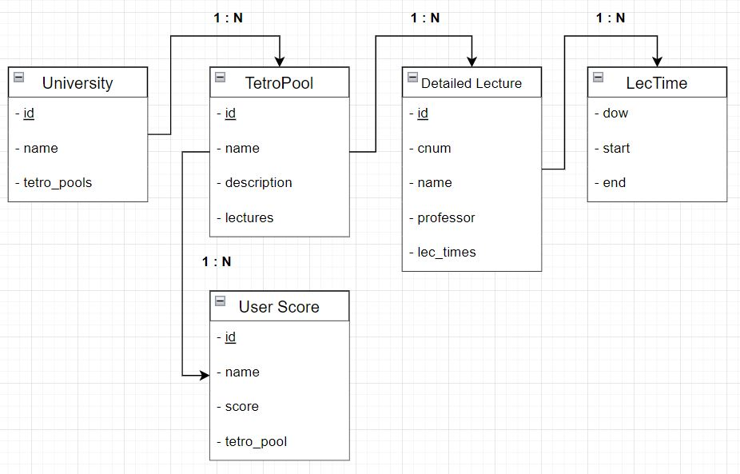
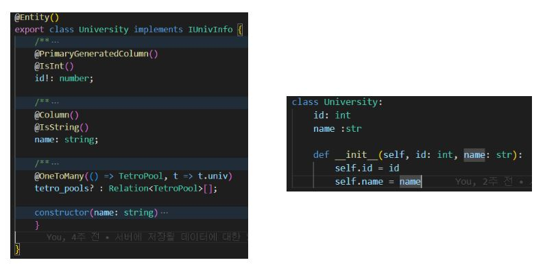

# 엔티티 설명

- University  : 테트로미노 풀이 소속된 대학을 가리키는 엔티티이다.
- TetroPool : 게임에 실제로 사용되는 테트로미노 풀이다.
- DetailedLecture : 테트로미노 풀에 속한 각각의 강의를 의미한다.
- LecTime : 강의 시간대를 의미한다. 현재 엔티티는 실제 게임을 플레이하는 시점에는 강의 정보(DetailedLecture)에 함께 포함되어 있으나, 하나의 강의가 다수의 LecTime을 가질 수 있어 multi-valued 성격을 지니기 때문에 mysql에 그대로 삽입할 수는 없으므로 별도 엔티티로 분리하여 관리한다.
- UserScore : 특정 테트로미노 풀에 대한 유저의 점수를 의미한다.

## 클라이언트 - 서버 API 대응표
클라이언트 - 서버에는  다음과 같은 대응 관계가 존재합니다.
| server  | API | Client | function |
|---|---|---|---|
|University|GET /api/info/univs|University|get_univs|
|TetroPool|GET /api/info/:tid/tetro-pools|TetroPool|get_tetro_list|
|DetailedLecture|GET /api/tetro/get-tetro/:tid|Lecture, DetailedLecture|get_tetro|
|LecTime|-|Lecture에 포함|-|
|UserScore|GET /api/tetro/get-scores/:tid  POST /api/tetro/set-score/:tid|UserScore|get_scores set_score|

- 함수 정의: https://github.com/CSID-DGU/2022-1-OSSP2-NOW-1/blob/main/util/http.py

  - get_univs : 서버상에 저장된 대학 목록을 가져온다. 현재 서버상에 저장된 대학 목록은 동국대학교 뿐이지만, 필요에 따라 추가할 수 있다.
  - get_tetro_list : 특정 대학에 속한 테트로미노 풀 정보를 가져온다. tid은 get_univs을 통해 얻은 대학의 id 값을 통해 가져온다.
  - get_tetro : 특정 테트로미노 풀을 id 기반으로 가져온다. 
  - get_scores : 특정 테트로미노 풀에 대한 점수 목록 중 상위 10개를 가져온다.
  - set_score : 특정 테트로미노 풀에 대한 점수를 등록한다.

## 대응 관계 예시

